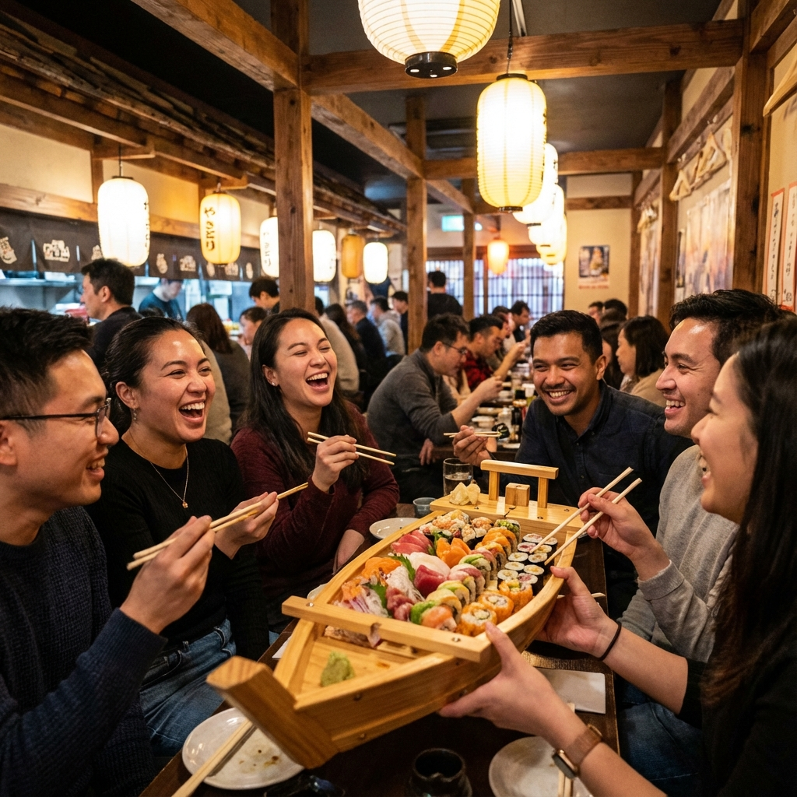
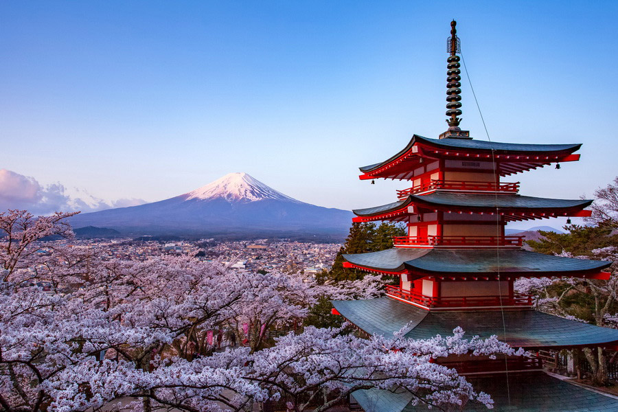

## El sueño de viajar a Japón

Japón siempre estuvo en mi lista de pendientes, y hacerlo en grupo fue la mejor decisión. Llegar a **Tokio** es como aterrizar en el futuro. Las luces, la gente, la energía... es abrumadoramente hermoso.

### Kioto: La magia tradicional

Pero si tuviera que elegir un momento favorito, sería nuestra visita a **Fushimi Inari**. Caminar bajo los miles de torii rojos con el grupo fue mágico. Nos reímos mucho intentando sacar la foto perfecta sin gente de fondo (¡casi imposible, pero lo logramos!).

La comida merece un capítulo aparte. Una noche fuimos a una izakaya (bar tradicional) y pedimos de todo un poco. El sushi fresco, el ramen humeante y, por supuesto, un brindis con sake para cerrar la noche.

Japón es un destino que te cambia la cabeza. La mezcla de respeto por la tradición y la tecnología de punta es fascinante. ¡Ya quiero volver!

---

### Galería de Fotos

    
    

