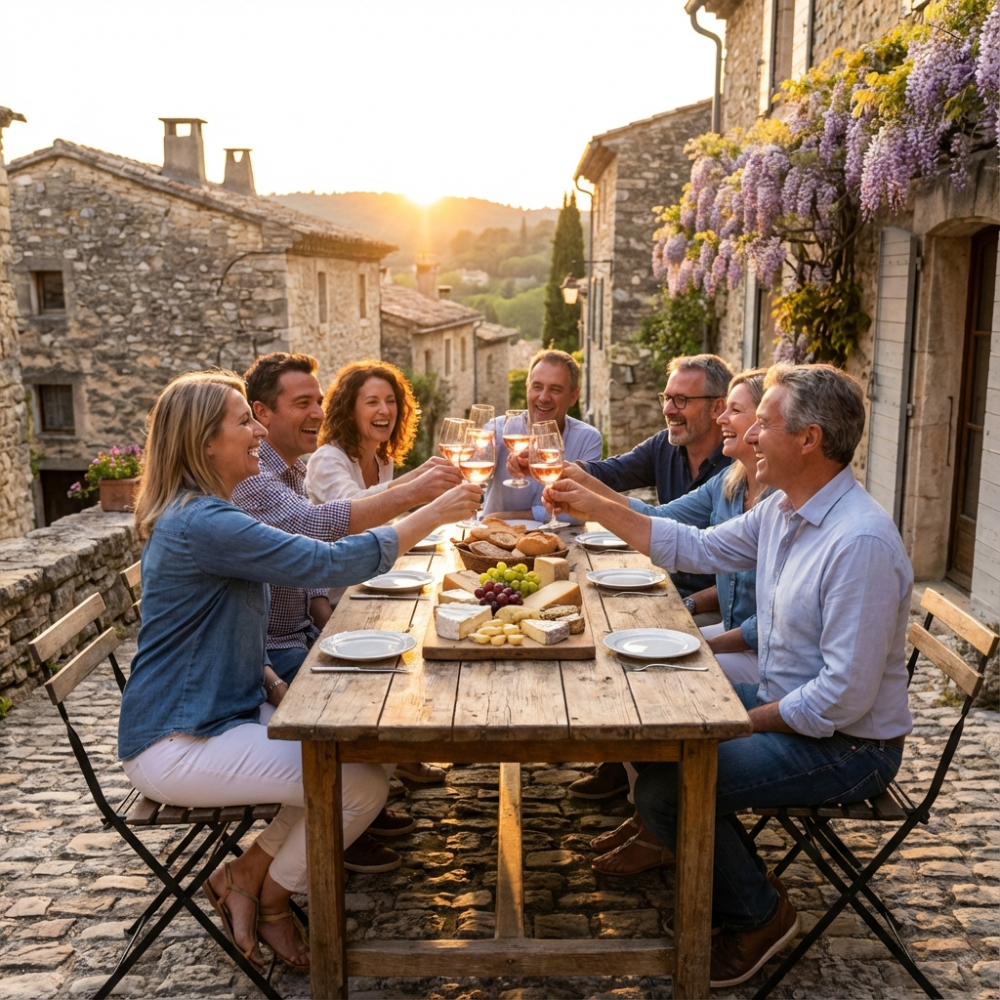
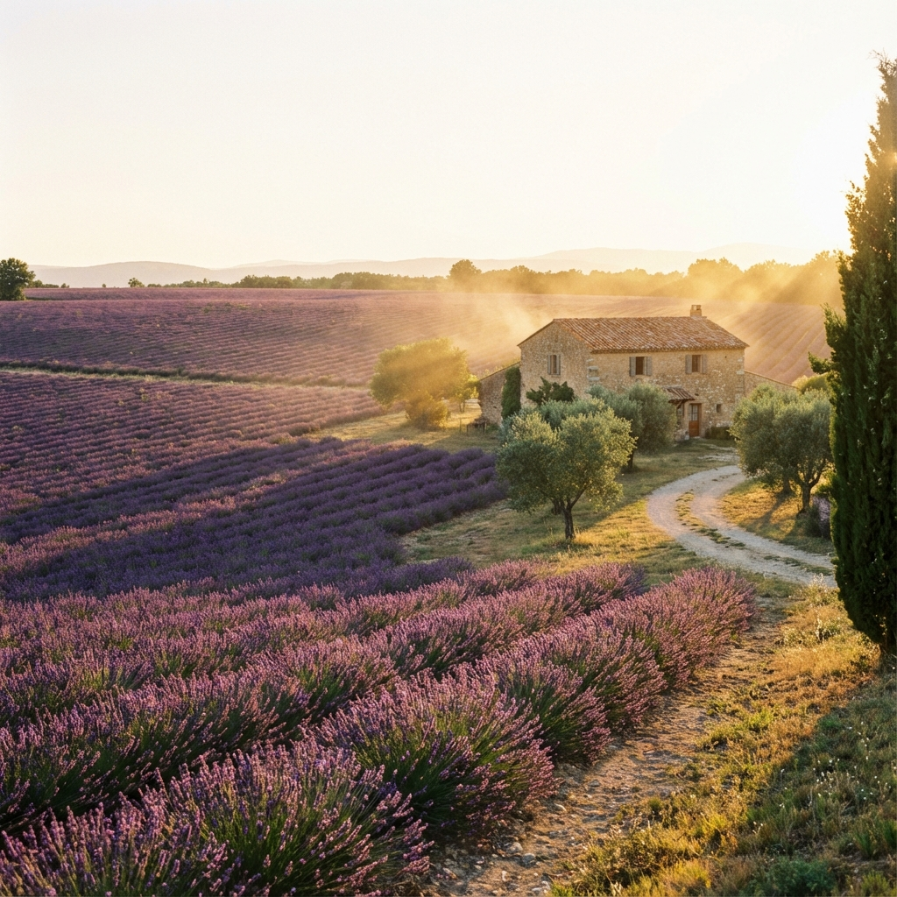

## La buena vida en el sur de Francia

Dicen que en la Provenza el tiempo pasa más lento, y es verdad. Este viaje fue todo disfrute. Desde que llegamos, el olor a lavanda nos acompañó a todos lados.

### Caminatas y Brindis

Recuerdo con mucho cariño una tarde que pasamos caminando por los campos violetas al atardecer. La luz dorada era perfecta para las fotos, y el clima era ideal. 

Pero lo mejor venía después: las cenas en los pueblitos medievales. Nos sentábamos en alguna terraza de piedra, pedíamos una tabla de quesos y brindábamos con vino rosado local. Esas charlas interminables con el grupo, bajo las estrellas, son las que me llevo guardadas para siempre.

Provenza no es solo un lugar lindo para ver, es un lugar para sentir y disfrutar con todos los sentidos.

---

### Galería de Fotos

    
    

