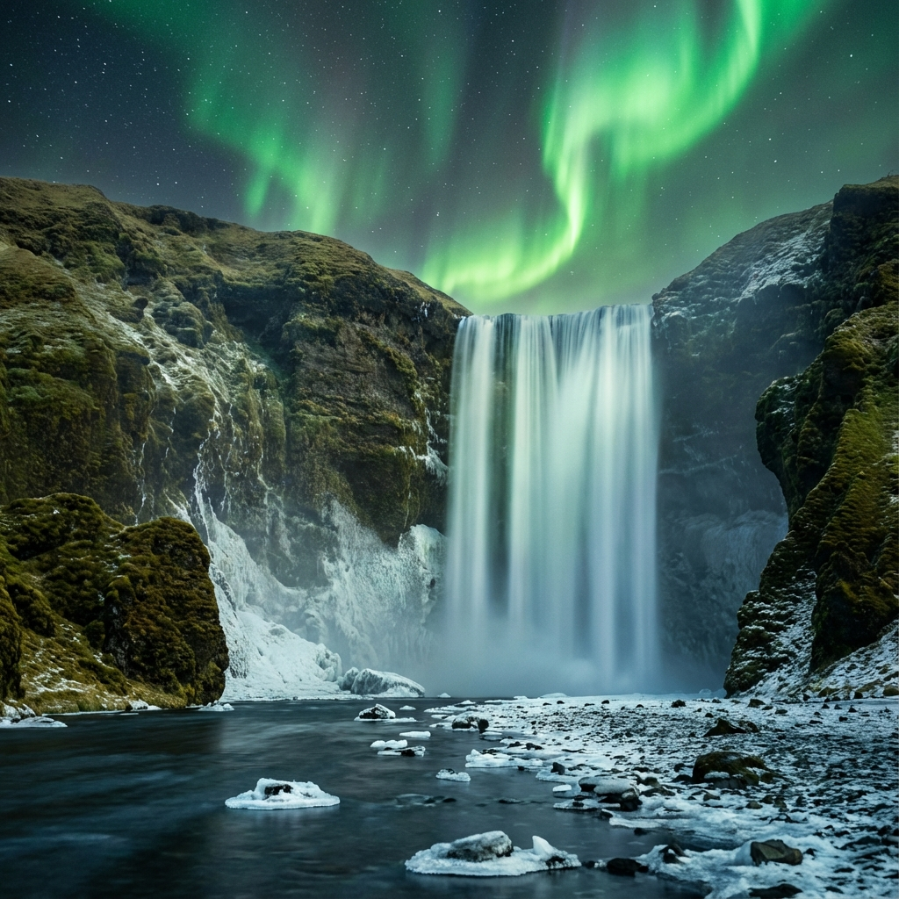

## Aventura en el Ártico

Islandia es un destino que parece de otro planeta. Preparate para nuestra salida del **5 de octubre**, donde la naturaleza se manifiesta en su forma más salvaje.

---

### Puntos Fuertes

* **Círculo Dorado:** Visitaremos el Parque Nacional Thingvellir, el géiser Geysir y la catarata Gullfoss.
* **Laguna Azul:** Nos relajaremos en las famosas aguas termales ricas en minerales, rodeados de campos de lava.
* **Auroras Boreales:** Octubre es un mes ideal para intentar avistar las "luces del norte". Tendremos salidas nocturnas especiales para cazarlas.

### Naturaleza Indómita
Descubrí por qué Islandia es el destino de moda para los amantes de la fotografía y la aventura.

---

**Cupos reducidos.** ¡Asegurá tu lugar en esta expedición única!
