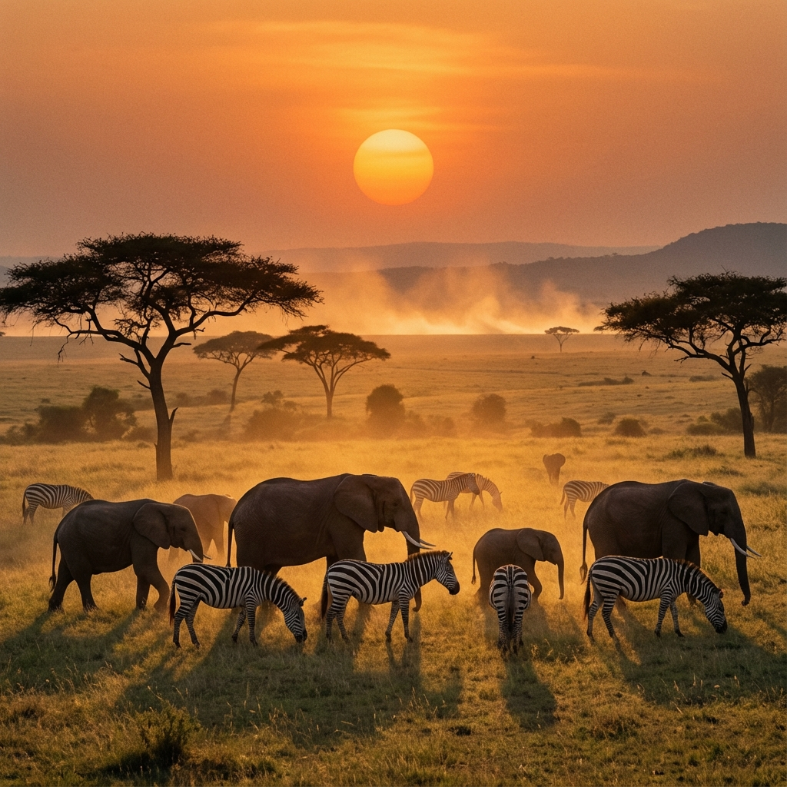

## El llamado de la selva

Si alguna vez soñaste con ver leones, elefantes y jirafas en su hábitat natural, este es tu viaje. El **12 de septiembre** partimos hacia el corazón de África Oriental.

---

### La Experiencia Safari

* **Masai Mara:** Recorreremos esta reserva mundialmente famosa, hogar de una increíble densidad de vida salvaje.
* **Serengueti:** Cruzaremos a Tanzania para explorar las llanuras infinitas del Parque Nacional Serengueti.
* **Cultura Masai:** Tendremos la oportunidad de interactuar con tribus locales y aprender sobre sus costumbres ancestrales.

### Alojamiento de Lujo
Dormiremos en *lodges* y campamentos de lujo, escuchando los sonidos de la naturaleza bajo un cielo lleno de estrellas.

---

### ¿Estás listo para la aventura?
Este es un viaje transformador. Contactanos para más detalles sobre vacunas y visados.
